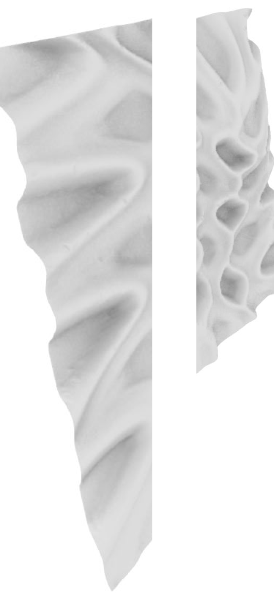

<!-- 

    
Please contact me if you would like to hear more about my experience!

 -->

<!-- 

    

 -->

    
 
        
 
             
        
 
       During the summer of 2019, I served as a design intern at 3M Japan, where I researched and explored several of the company's advanced materials including DI-NOC films. Exploring the relationship between textures and patterns, I helped create new implementations and designs of their materials.
        
        
       Send me a message if you would like to hear more about my experience!
    

    

