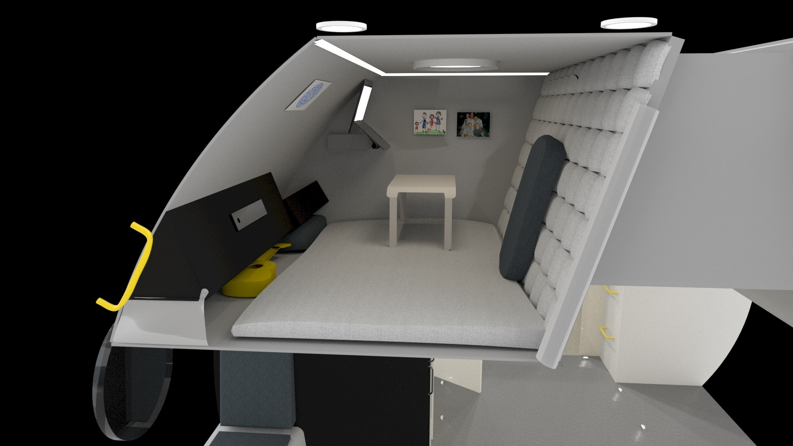
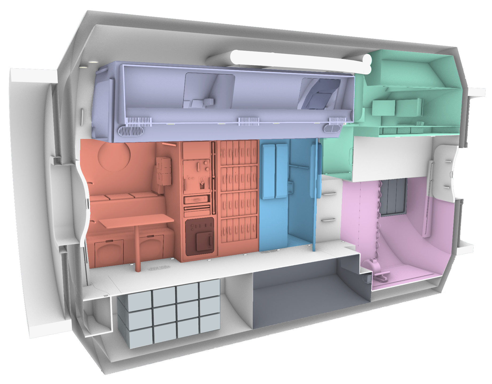
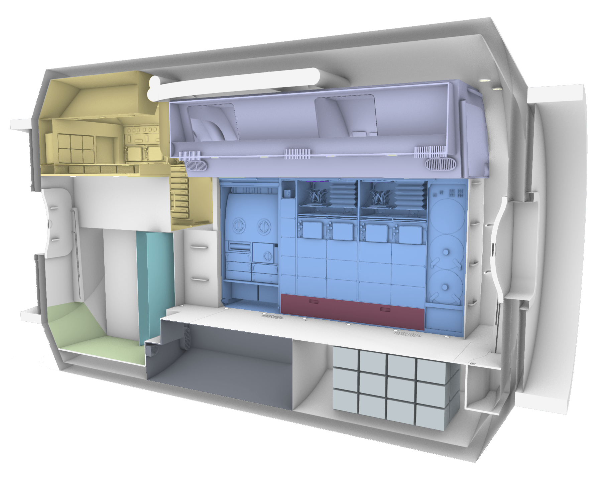

 Intro 

 
    In the spring of 2020, working collaboratively with six other designers, we presented a habitat design to NASA for the 2024 Artemis mission. We were taught and guided by Michael Lye, NASA coordinator and RISD professor. 
       
    The objective was to <b> design a lunar surface habitat for a 30-day mission for 4 astronauts. The habitat was to be contained within a cylindrical module with an interior of 4.4 meters by 7 meters. 
    </b>
       
     <b>My Role:</b> Crew Quarters Lead

  

  

  

  

