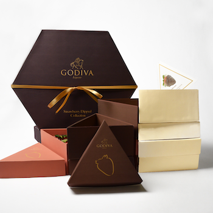
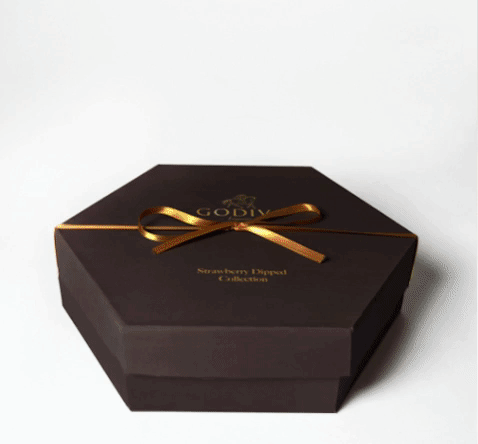

   As part of a team project, we repackaged Godiva’s chocolate-covered strawberries.
   Thinking about efficient space usage, structure, and the unpackaging experience, we designed a hexagonal box that is more interactive and appropriate for the brand.

 <!--   -->
    

  
     
  

