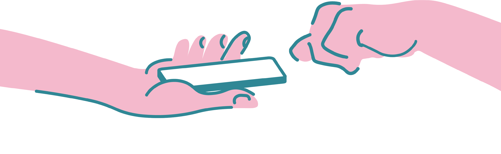
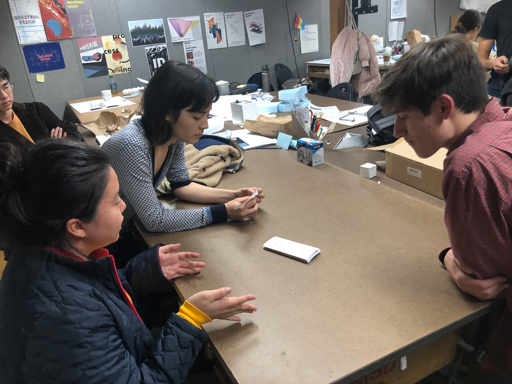

<!-- <b style = "color:gray;font-size: 10pt;font-weight:bold;">
TEAMMATES: Jennifer Xu, Jessica Hsiao, and Shuyuan Zheng
</b> -->

    <b>Intro: </b> When you look around the streets, most people have their faces buried in their smartphone screens oblivous to the rich 
    possibilities in their own neighborhood. <!--   -->
    My teammates and I designed an app to help explore their personal geography, a way to pin the shops, locales and spots with personal meaning in their community.  <!--   -->
    What if you could knock your screen to pin your location 
    using GPS?

    

Research

    <h6 class = "paragraph" style="background-color:#f9f9f9;">
     According to our survey research, users on the move listen to music, go on social media and use navigation tools. It’s as if they are on a different planet! 
The richness of their neighborhoods and local communities go unexplored.
   
     Current mapping apps are great for finding how to get from point A to B.  
They don’t curate interesting things to do in your immediate neighborhood or report incidents or construction site work.

    </h6>

  

    Our Mission

 
<h6 class = "paragraph" style="background-color:#f9f9f9;">
     Give people a greater sense of their own personal geography, allowing them to better connect with their community.  
    </h6>

    

    Knock Knock

 
    On Huawei mobile, users can knock their knuckles on their screens to trigger a feature like a screen shot. This function could also be used to engage GPS to capture and pin a specific location without the hassle of opening several apps. We envision this being an option on more smartphones in the future.

    Meet Banks!

    

     
    Sam loves to explore new areas and shops. Unfortunately, he does not have much time during the work week to experience his neighborhood.     
    He would like a way to take note of interesting locations that he can enjoy later or share with the broader community 
    anonymously. 

    Ideation
    

 <h6 class = "paragraph" style="background-color:#f9f9f9;">
     After we had a clear idea of the features we wanted to focus on, we started creating paper mockups of our ideas. After several rounds of user-testing, we took a trip to Boston to experience a dense urban setting to imagine how a user might micro-map using this app. 
 </h6>

  Features

  

  

  Process

  

  1: Paper mockups

  2: User testing and feedback of initial design. 

  3: Iterate and refine. 

  

      
  

  

      
  
 
  

      
  

    Final Designs
    

 <h6 class = "paragraph" style="background-color:#f9f9f9;">
     The final design invites users to explore and pin interesting locales around their community by guiding them through 2 simple steps:<b style = "color:blue"> maps</b> and <b style = "color:blue"> activity logs.</b> 
       
       
     Personal association is key to remembering places. The activity log allows users to view and retain locations or events that they found interetsing throughout the day. 
      

 </h6>
 

      Notifications
  
 
  

    

        
    

    

        
    

     

        
    

  

  

      Maps
  
 
  

      
  

   
  

       Acitivity Log
  

  

    
  

<!-- 

    Refinements
    

<h6 class = "paragraph" style="background-color:#f9f9f9;">
     Motivation is some thing
</h6> -->

    Self Reflection
    

How we retain information through screens is something that has perplexed me for a while. While the ubiquity of smartphones is something that gives us convenience, it seems as though people are being less mindful about what the kind of information we intake. 
Most of us have thousands of pictures in our camera roll, but how many of those pictures do we remember taking?
This project allowed me to explore ways in which people can connect to their environment with the help of their phone, instead of depending soley on their phone.  
 
 
In terms of the process, I noticed how <b style = "color:blue;">  user-testers are really good at pointing out the blindspots. It can be difficult to step out of your project and view things from a different perspective. </b>
 

  Note to future self: 

  <b >
  Challenges are a lot more fun when you have a passionate group of teammates working by your side. 
  

<!-- 

    

    

