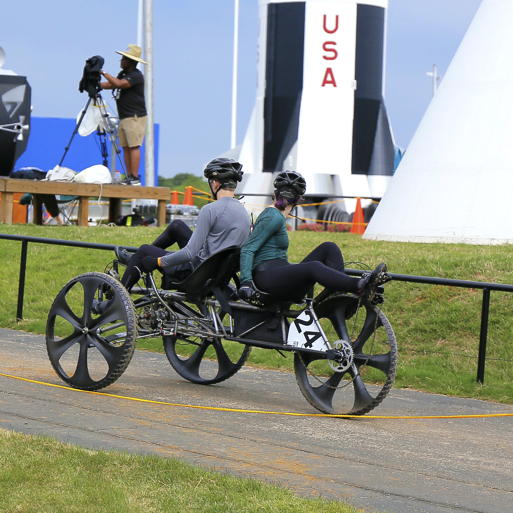

    Human exploration rover challenge is an annual competition held by NASA. The participants are required to design a human-powered vehicle that can run on a simulated Mars terrain.
    Our process includes research, testing, and refining. In 2019, our team won the  Featherweight class design award and placed second among 100 other schools. 

     

  <a href="https://www.nasa.gov/stem/roverchallenge/competition/index.html">Human Exploration Rover Challenge</a>

<!--  <video controls autoplay loop >
    <source src="./rover/rover_vid.mov" type="video/mov">
</video> -->