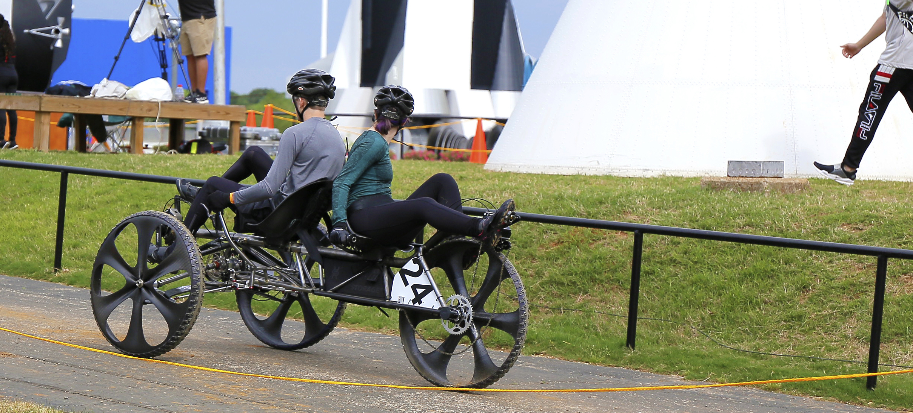
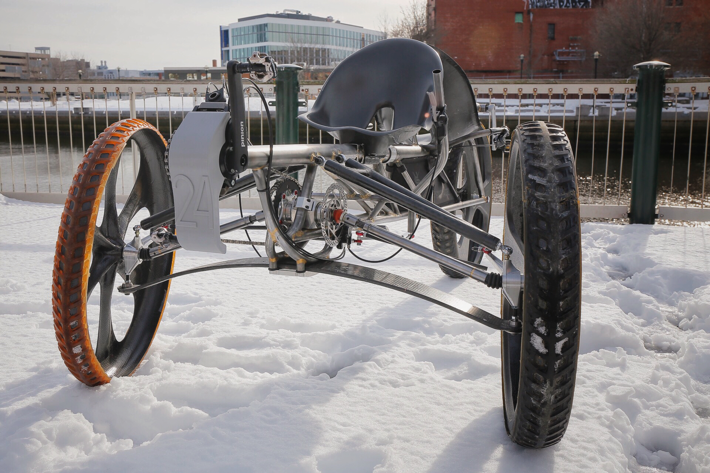
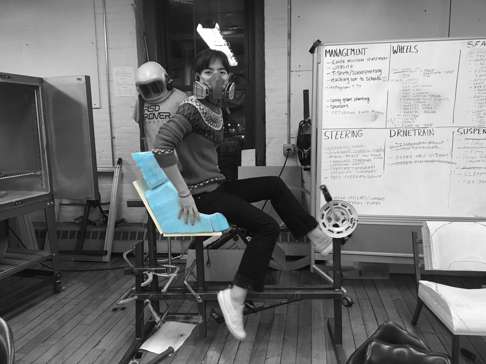
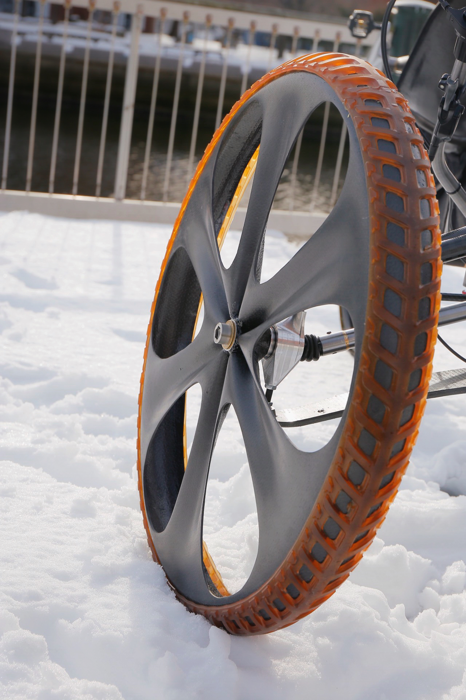

  <a href="https://www.nasa.gov/stem/roverchallenge/competition/index.html">Human Exploration Rover Challenge</a>

     

    RISD Rover
    

   
    <h6 class = "paragraph">
     RISD rover is a club run by students and advisor <a style = "color: gray; border-bottom: 2px solid gray; text-decoration:none" target="_blank" href="https://www.risd.edu/people/michael-lye/">Michael Lye</a> - RISD professor and NASA coordinator. The club takes part in an annual NASA competition to race
     against over 100 engineering schools. In the 2019 race, RISD placed second and received the Featherweight award. 
     We design and fabricate most compartments of the rover, including the chassis, seats, wheels, steering, suspension, and additional products required for the obstacles. 
     
     
     <b style = "text-decoration: underline">Materials used:</b> Chromoly steel, Carbon fiber, Aluminum, Steel, Fiberglass
     
     <b style = "text-decoration: underline">Machine tools used:</b> 3D printer, Lathe, Bridgport mill, CNC, Vacuum former, TIG welding, Brazing. 
    </h6>

   

   

    My Role
    

       
    <h6 class = "paragraph">
     I am responsible for leading seats. We begin our process by carving blue foam to get a general shape of the seat. We then test with riders and iterate further. Once we’ve finalized our shape, we make a mold with fiberglass, finishing up with the carbon fiber layup with our mold.
    </h6>

   

 

       

    Constraints
    

   
    <h6 class = "paragraph">
     As with any competition, the NASA rover challenge has a set of constraints we have to design around. The guidebook states that the rover must fit in a 5’ x 5’ cube. Instead of making the whole vehicle shorter in length, we created a folding mechanism placed in the center of the chassis to enable folding. 
    </h6>

 

       

 <video controls autoplay loop style = "width:30%; margin-top:150px; margin-left:400px;" >
    <source src="./rover/rover_vid.mp4" type="video/mp4">
</video>

     

     

