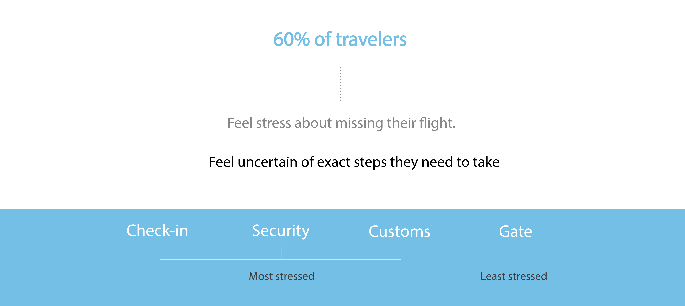
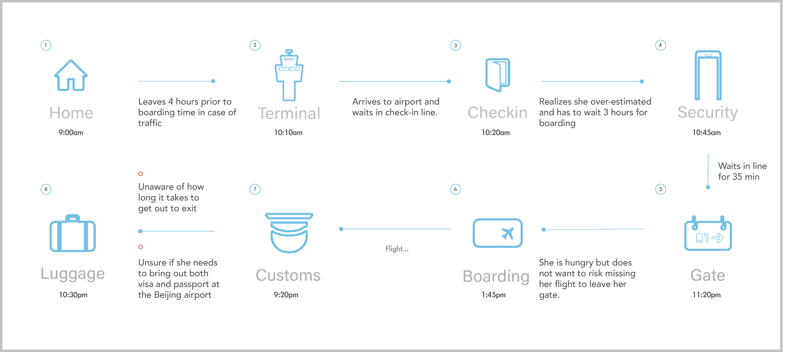
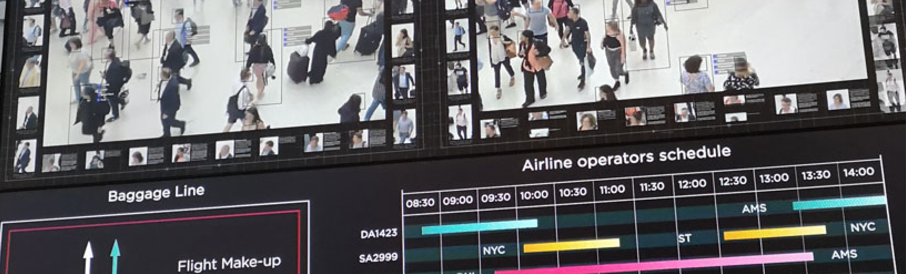
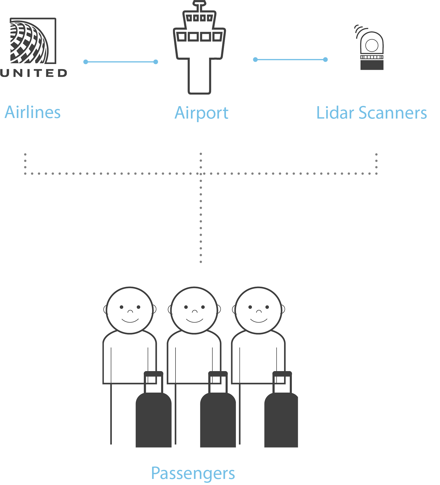
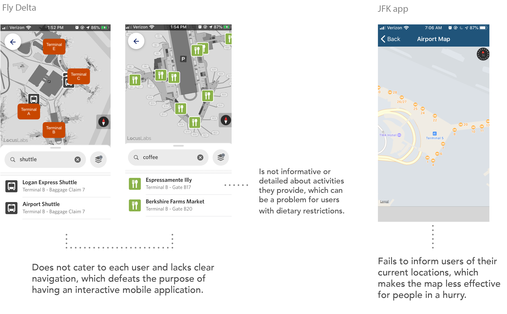
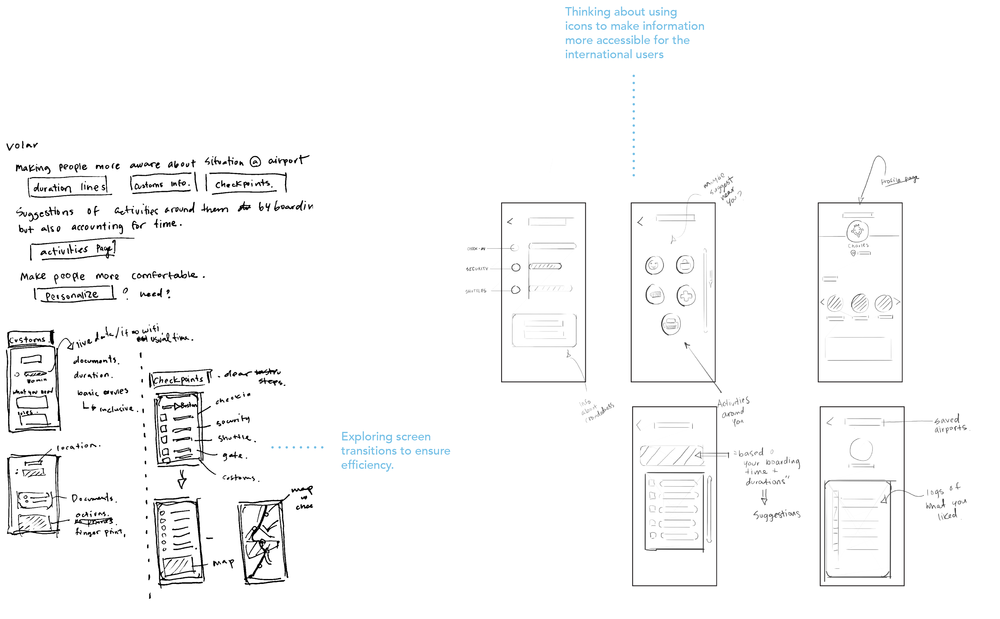
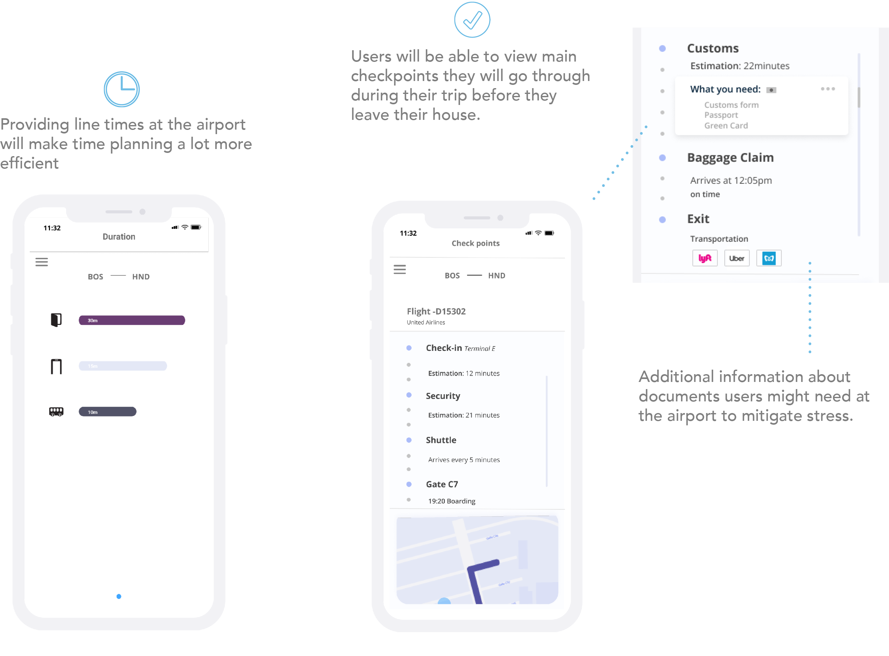
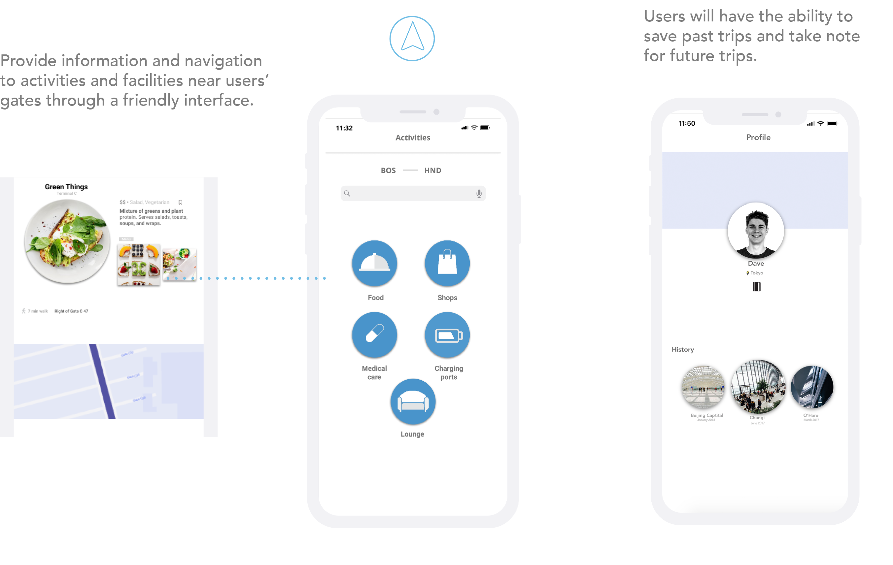
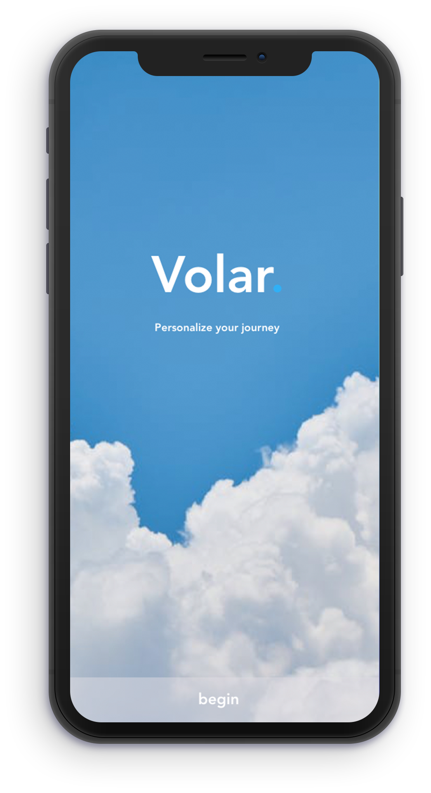

  The US is certainly not known for its world-class airports. The top-ranked US airport in the 2019 Skytrax Ranking is Denver Airport, which came in 32nd place. In contrast, Singapore Changi airport was awarded best airport honors, deservingly so given its impeccable architecture and fluid transitions between shops and facilities that help passengers forget that they are in an airport. 
  Yet most of these higher ranking airports were built fairly recently. For example, Singapore Changi airport opened in 2014, while most of the US airports like JFK were built in the early post-war era.  Here’s the challenge: How can we improve a US passenger’s experience navigating the complex architecture and layout of older American airports?

    

<!-- 1 -->

    Research
    

    <h6 class = "paragraph">
      How do we improve the airport experience without changing the architecture or layout?
       To highlight checkpoints of what people found most stressful and frustrating at airports, 
       I began my project with some research and interviews conducted on regular flyers. Additionally, I looked 
       at existing airport platforms and apps to see what is working well or what people are lacking during
       the experience. It was also critical to look into limitations and existing technologies that could
       be implemented into making information accessible to the users as much as possible. 
    </h6>

<!-- 1a -->

    Passengers have a small time window but no information about how to use it. They're stumbling around in 
    the dark and can use some guidance to get to their destination.

     

     

     
     
<!-- 1b -->

    THE PROBLEM

    How can I improve the passenger’s experience navigating the complex architecture and layout of airports?

<hr/ width="100%">

    INTERVIEW FINDINGS

 

    1. Uncertainty of catching their flight.
   
   
    2. Fear of authoritative figures at airports having the power to decide if you get to enter the country.
   
   
    3. Inefficient use of time.  

     
     
<hr/ width="100%">
 

     

<!-- 1c -->

    STORYBOARD

    Millie is an experienced flyer. Even she gets frazzled by air travel every now and then.   
    Different airports have different procedures and Millie has missed a few flights because of it. She wishes she had more confidence that she will get to her gate on time.

     

<!-- 1d -->

    PLAYERS

    To view constraints and existing technologies, I created a diagram of stakeholders involved. 
   Lidar scanners allow airports to view how crowded the airport is in live time. 

<!-- 

     

 -->

     

<!-- 1e -->
<hr/ width="100%">

  EXISTING PLATFORMS

<!-- 

    It was critical for me to view the what's out there and why people aren't using them. 

 -->

     

<!-- 1f -->
<hr/ width="100%">

    FEATURES

     

    Ideation
    

 <h6 class = "paragraph" style="background-color:#f9f9f9;font-family: 'IBM Plex Sans' ">
     After I had a clear idea of my constraints, I went into my ideation stage. Using the journey map to see the checkpoints and or any possible frustrations users may face, I started sketching out possible interfaces.
    
     During this time, I focused on keeping the design as simple as possible. Passengers are already occupied by the hectic airport, the last thing they need is a complicated app disrupting their flow. 
 </h6>

    SKETCHES

    Sketching and ideating allowed me to hash out focal user needs and simplify the solutions.

     

    WIREFRAMES

    Sketching and ideating allowed me to hash out focal user needs and simplify the solutions.

     

<!-- 2a-->

  Final Designs
  

    After many iterations based on feedback, I created finalized interfaces for the app. 

     

     

<!-- 

     

 -->

  Reflection
  

<!-- <video class = "vidsize" controls autoplay loop>
  <source src="./volar/foodyes.mp4" type="video/mp4">
</video>
<video class = "vidsize" controls autoplay loop>
  <source src="./volar/tic.mp4" type="video/mp4">
</video> -->

